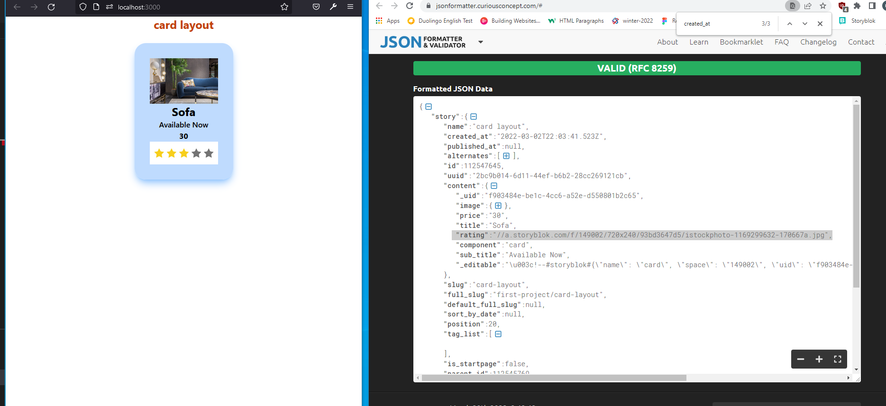

# cpnt262-achievement-8

## Maryam Khan

## Async Fetch Nuxt

- [GH repo](https://github.com/maryambkhan/cpnt262-achievement-8)
- [Netlify Site](https://famous-griffin-9f41d5.netlify.app/)

### Code Journal

- I installed the repo yesterday and fetched some stuff too today when i 
  itstalled i added wrong storyblok and it broke my work i did not understood 
  what was wrong so deleted whole repo and created new one still i had problem.
  All of sudden i remember that for nuxt3 i need diffrenet one
  so went back to my notes and opend the right document for storyblok and it worked
  [storyblok](https://www.storyblok.com/mp/storyblok-meets-vue3-nuxt3).
- Plan:
  - I am going  to fetch one of the api from storyblok that i already had worked on.
- So i took a story from story blok and fetched the data and created a card on html page.
- I had little setback with fetching image then i found this  ``
- It was really hard experience for me i  think practiced on almost all of my storries from 
 story blok and this is the only one i got rnender properly 
 
- I am working on this page layout i finally render the body on page but i am stuck with 
  footer i dont know how to do it .AAAAHHHHH it is annoying
- Understanding the hierachy of story is very important.
- Finaly i think its making sense to me ,I found my structure in storyblok was too nested that was causing 
  problem for me to fetch.
- I did more practice on fetching public api and finaly i got it 
- I was able to fetch gibli studio api WIN Today!!!

### Attributions
 
- Ghibli studio api
- Google Photos
